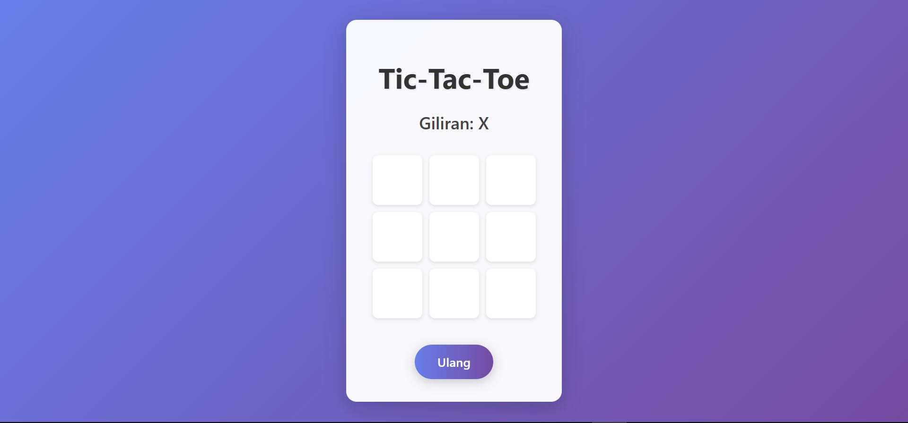
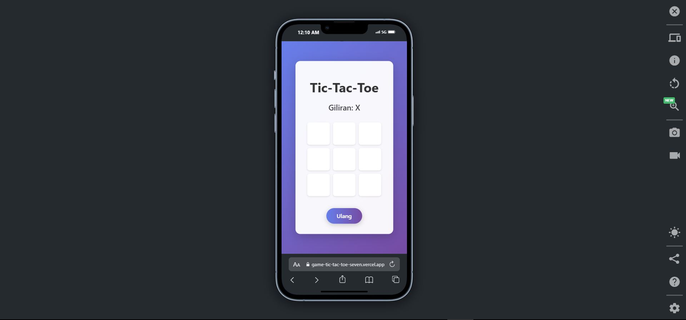

# Game Tic-Tac-Toe



## Deskripsi
Game Tic-Tac-Toe adalah permainan sederhana yang dibuat menggunakan React dan Vite. Permainan ini memungkinkan dua pemain untuk bermain secara bergiliran, dengan tanda "X" dan "O". Fitur utama meliputi:

- Pemain bergantian antara "X" dan "O".
- Deteksi pemenang secara otomatis berdasarkan kombinasi baris, kolom, atau diagonal.
- Status permainan yang menunjukkan giliran pemain atau pemenang.
- Tombol "Ulang" untuk memulai permainan baru.
- Desain responsif yang mendukung tampilan desktop dan mobile.

Proyek ini telah dideploy ke Vercel dan dapat diakses secara online.

## Link Website
[Mainkan Game Tic-Tac-Toe](https://game-tic-tac-toe-seven.vercel.app/)

## Teknologi yang Digunakan
- **React**: Library JavaScript untuk membangun antarmuka pengguna.
- **Vite**: Build tool modern untuk pengembangan frontend yang cepat.
- **CSS**: Untuk styling antarmuka permainan.
- **Vercel**: Platform untuk deployment dan hosting aplikasi.

## Preview
### Desktop


### Mobile


## Cara Menjalankan Secara Lokal
1. Clone repository ini:
   ```bash
    git clone https://github.com/FadhliRajwaa/game-tic-tac-toe.git

    cd game-tic-tac-toe

    npm install

    npm run dev

    Buka di browser: http://localhost:5173

